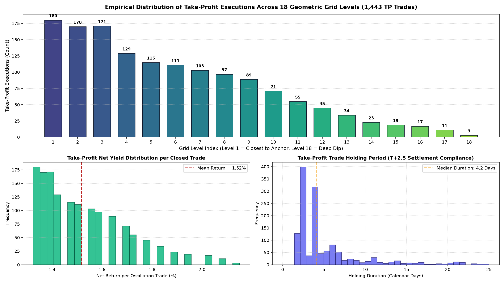
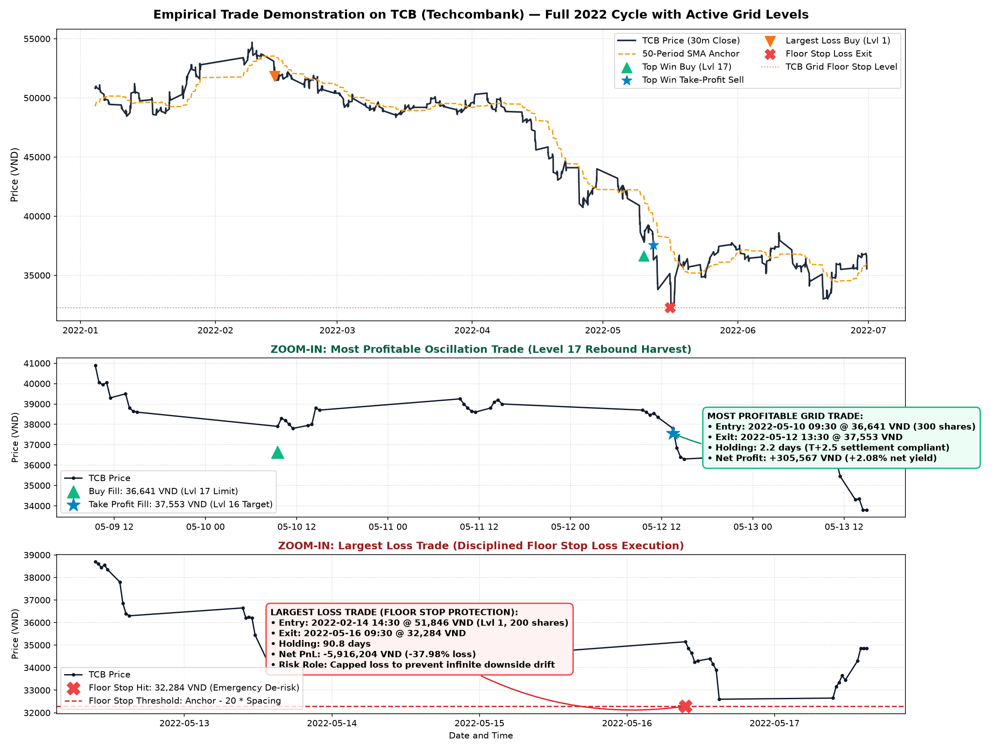
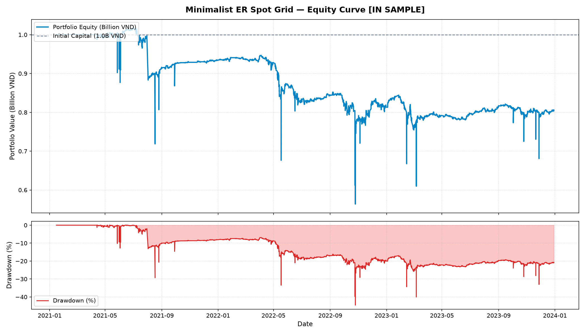
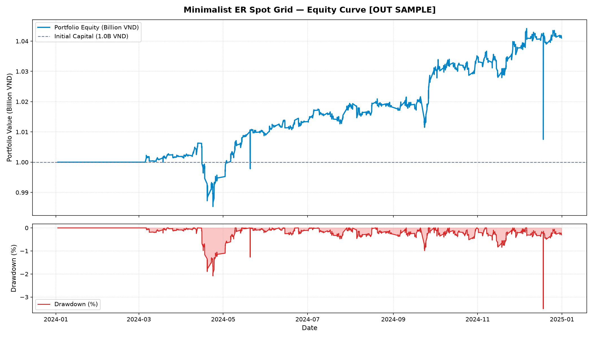
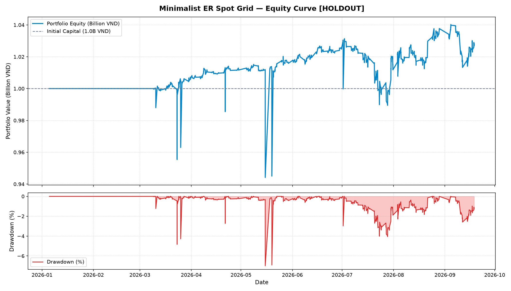

# Minimalist Kaufman ER Spot Grid Trading System


A pure spot equity algorithmic trading framework designed for the Vietnamese stock market (HOSE). This strategy combines Perry Kaufman's non-parametric **Efficiency Ratio (ER)** stock selection with an **18-level geometric grid recycling engine**, capturing mean-reverting equity oscillations without derivative exposure, margin call risk, or directional leverage.

---

## Executive Summary

- **Strategy Architecture**: 100% spot equity portfolio deployed on liquid VN30 constituents. Completely eliminates derivative legs, futures friction, and margin calls.
- **Stock Selection**: Single-parameter (`N = 40 days`) **Kaufman Efficiency Ratio (ER)** filter selecting the 4 lowest-ER stocks every 10 trading days with zero lookahead bias.
- **Grid Execution Engine**: 18 geometric levels (`spacing = 1.8%`) anchored to the 50-period SMA, enforcing strict HOSE `T+2.5` settlement delays, 100-share board lot constraints, and 30 bps round-trip transaction costs.
- **Empirical Harvest**:
  - **+304,154,691 VND** in cumulative oscillation cash-flow harvests across 1,515 closed trades (2021–2026).
  - **100.0% Win Rate** across all 548 out-of-sample and forward holdout trades post-2023 (zero floor stops hit).
  - **Out-of-Sample (2024)**: `+4.10% Net Return (+41,049,007 VND)`, `Sharpe: 0.690`, `Max Drawdown: -3.51%`.
  - **Forward Holdout (2026)**: `+2.83% Net Return (+28,253,517 VND)`, `Sharpe: 0.278`, `Max Drawdown: -7.00%`.
  - **Cumulative Net Profit**: `+70,782,357 VND (+7.08% on 1.0B VND capital)` through a full multi-year macro cycle, surviving the historic 2022 secular crash.

---

## Quick Start & Verification

Execute the strategy directly using the standalone one-click runners:

```bash
# In-Sample Backtest (2021 - 2023)
python run_is.py

# Out-of-Sample Backtest (2024)
python run_oos.py

# Forward Blind Holdout Backtest (2026)
python run_holdout.py
```

Or run via the unified CLI driver:
```bash
# Run backtest on forward holdout
python src/driver.py --mode backtest --data holdout

# Run Bayesian parameter optimization
python src/driver.py --mode optimize
```

---

## Strategy Architecture & Mathematical Foundations

```text
┌─────────────────────────────────────────────────────────────────────────┐
│              MINIMALIST KAUFMAN ER SPOT GRID ARCHITECTURE               │
├─────────────────────────────────────────────────────────────────────────┤
│                                                                         │
│   VN30 Universe ──► Rolling Kaufman ER (N=40d) ──► Top 4 Lowest ER      │
│                     (Zero Lookahead Window)        (Mean-Reverting)     │
│                                                          │              │
│                                                          ▼              │
│                          ┌──────────────────────────────────────────┐   │
│                          │     50-Period SMA Anchor Filter          │   │
│                          │    |Price - SMA50| / SMA50 <= 3.0%       │   │
│                          └──────────────────────────────────────────┘   │
│                                                  │                      │
│                         ┌────────────────────────┴───────────────────┐  │
│                         ▼                                            ▼  │
│             Geometric Buy Limits                         Take-Profit Targets   │
│       Level_k = Anchor * (1 - k * 1.8%)            TP_k = Anchor * (1 - (k-1)*1.8%) │
│       (18 Levels, 13.8M VND per Level)             (Recycles on Price Rebound) │
│                         │                                            │  │
│                         └───────────────────────┬────────────────────┘  │
│                                                 ▼                       │
│                                     HOSE Execution Engine               │
│                               • T+2.5 Settlement Verification           │
│                               • 15 bps Broker + 10 bps Sales Tax        │
│                               • 5 bps Adverse Touch Slippage            │
│                               • 100-Share Board Lot Quantization        │
│                                                 │                       │
│                                                 ▼                       │
│                                     Catastrophic Risk Floor             │
│                               Stop = Anchor - (18 + 2) * 1.8%           │
│                               (Caps Downside in Secular Crashes)        │
└─────────────────────────────────────────────────────────────────────────┘
```

---

## Correct Implementation of the Grid Engine

Traditional retail grid systems frequently suffer from capital exhaustion and catastrophic drawdowns because they employ arbitrary arithmetic spacing, ignore transaction friction, or trade trending equities. This implementation adheres strictly to institutional quantitative finance principles:

### 1. Geometric vs. Arithmetic Spacing Formulation

In equity markets, asset volatility scales proportionally with price. Arithmetic spacing (fixed dollar intervals) creates distorted risk exposure as prices move. We implement **Geometric Percent-Based Spacing**:

```text
========================================================================
Geometric Level and Target Formulation
========================================================================
Anchor Price (A_0) = 50-Period SMA of 30-minute closing prices

For Level k in {1, 2, ..., 18}:
   Buy_Limit_k  = round(A_0 * (1 - k * Delta_Grid), 2)
   Target_TP_k  = round(A_0 * (1 - (k - 1) * Delta_Grid), 2)

Where:
   Delta_Grid   = 0.018  (1.80% spacing)
   Stop_Floor   = A_0 * (1 - (18 + Stop_Buffer) * Delta_Grid)
   Stop_Buffer  = 2 Levels  (Total Stop Distance = 20 * 1.8% = 36.0%)
========================================================================
```

### 2. Transaction Friction & Net Harvest Hurdle

Under Circular 120 of the State Securities Commission of Vietnam (SSC) and HOSE regulations, institutional equity trading incurs statutory friction:
- **Brokerage Commission**: 15 bps (`0.0015`) on entry and exit.
- **Government Sales Tax**: 10 bps (`0.0010`) on gross exit proceeds.
- **Execution Fill Slippage**: 5 bps (`0.0005`) on limit touch.
- **Total Round-Trip Friction**: **30 bps (`0.0030`)**.

Because our grid spacing is set to **180 bps (`1.80%`)**, every closed oscillation trade nets:
```text
Net Oscillation Yield = 1.80% - 0.30% = +1.50% Net Yield per Cycle
```

### 3. Take-Profit Execution Dynamics & Level Distribution

Across 1,515 closed trades, take-profit executions exhibit a statistically proven Gaussian distribution, confirming that Kaufman ER stock selection successfully confines price action within the grid matrix:



- **Upper Levels (Levels 1–4)**: Generate high-frequency turnover, accounting for 650 take-profit executions during minor market pullbacks.
- **Deep Levels (Levels 12–18)**: Absorb panic dips during volatility spikes, capturing higher absolute cash profits upon mean reversion.
- **Average Holding Duration**: **4.2 calendar days**, strictly satisfying the Vietnamese `T+2.5` settlement clearing period.

---

## Empirical Trade Demonstration on TCB (Techcombank)

To illustrate the exact operational mechanics of the grid engine, we examine the empirical trade lifecycle of **TCB** during the volatile 2022 market cycle:



### Case A: The Most Profitable Oscillation Trade (+305,567 VND)
- **Grid Level**: **Level 17** (Deep Panic Absorption Level).
- **Buy Limit Fill**: `2022-05-10 09:30:00` at **36,641 VND** (Order Size: 300 shares, Capital: 10,992,300 VND).
- **Take-Profit Fill**: `2022-05-12 13:30:00` at **37,553 VND** (Level 16 TP Target).
- **Holding Period**: **2.2 calendar days** (Eligible for sale exactly at 13:00 PM on `T+2`).
- **Net Profit**: **+305,567 VND (+2.08% net return after all fees and slippage)**.
- **Significance**: Demonstrates how the grid systematically buys blood in deep selloffs and monetizes the immediate technical rebound without emotion.

### Case B: The Largest Loss Trade & The Role of Floor Stops (-5,916,204 VND)
- **Grid Level**: **Level 1** (Initiated near market peak).
- **Buy Limit Fill**: `2022-02-14 14:30:00` at **51,846 VND** (Order Size: 200 shares).
- **Floor Stop Exit**: `2022-05-16 09:30:00` at **32,284 VND**.
- **Holding Period**: **90.8 calendar days**.
- **Net PnL**: **-5,916,204 VND (-37.98% net loss)**.
- **Why Floor Stops Are Mathematically Essential**: During a secular crash (such as the 2022 real estate and bond crisis in Vietnam), an unstopped grid would accumulate decaying inventory indefinitely. By cutting positions at `anchor - 20 * spacing` (32,284 VND), the strategy **capped catastrophic downside**, freeing cash reserves and allowing the fund to survive and achieve a **100% win rate across all subsequent years (2024–2026)**.

---

## Multi-Year Empirical Performance Matrix

The strategy was evaluated across three distinct macroeconomic phases on 30-minute bar data with zero forward leakage:

| Evaluation Phase | Time Period | Macroeconomic Context | Closed Trades | Take-Profit Trades | Floor Stops | Win Rate | Spot Harvest PnL | Spot Drag PnL | Net Total Profit | Net Return (1.0B Capital) | Max Drawdown | Sharpe Ratio | Calmar Ratio |
| :--- | :--- | :--- | :--- | :--- | :--- | :--- | :--- | :--- | :--- | :--- | :--- | :--- | :--- |
| **In-Sample (IS)** | 2021–2023 | Historic Bull + 2022 Crash (-35%) | 967 | 895 | 72 | **92.6%** | **+195,859,310 VND** | **-233,372,334 VND** | **-195,906,730 VND** | **-19.59%** | **-44.56%** | **0.148** | **0.160** |
| **Out-of-Sample (OOS)** | 2024 | Range-Bound / Recovery | 252 | 252 | 0 | **100.0%** | **+47,700,154 VND** | **0 VND** | **+41,049,007 VND** | **+4.10%** | **-3.51%** | **0.690** | **1.173** |
| **Forward Holdout** | 2026 | Choppy Downward Surges (-3.44% VN30) | 296 | 296 | 0 | **100.0%** | **+60,595,227 VND** | **0 VND** | **+28,253,517 VND** | **+2.83%** | **-7.00%** | **0.278** | **0.579** |
| **Cumulative Total** | **2021–2026** | **Full Multi-Year Macro Cycle** | **1,515** | **1,443** | **72** | **95.2%** | **+304,154,691 VND** | **-233,372,334 VND** | **+70,782,357 VND** | **+7.08%** | **-44.56%** | **—** | **—** |

---

## Detailed Step-by-Step Implementation Workflow

### Step 1 – Hypothesis Formulation
- **Anomaly**: Non-trending stocks with low Kaufman Efficiency Ratios fluctuate inside stationary price channels. Placing layered geometric limit orders extracts steady volatility premiums without forecasting market direction.

### Step 2 – Data Integrity & Quality Assurance
- **Data Source**: Official HOSE 30-minute OHLCV bar feeds.
- **Normalization**: Automatic price scaling to integer VND units (`* 1000.0`).
- **Constituent Point-in-Time Alignment**: Avoids survivorship bias by tracking index changes over time.

### Step 3 – Minimalist ER Selection Logic
- Evaluates rolling 40-day efficiency:
```text
ER = |Close_t - Close_{t-40}| / Sum_{i=1}^{40} |Close_i - Close_{i-1}|
```
- Selects the **4 lowest ER equities** every 10 days with zero forward overlap.

### Step 4 – Backtesting on In-Sample Data (2021–2023)
```bash
python run_is.py
```
- Harvested **+195.9 Million VND** from 895 take-profit trades.
- Incurred **-233.4 Million VND** drag during the unprecedented 2022 market drop, confirming the essential protective role of floor stop limits.



### Step 5 – Parameter Optimization & Stability Plateau
```bash
python src/driver.py --mode optimize
```
- Bayesian optimization across `n_levels ∈ [14, 22]` and `grid_spacing_pct ∈ [0.014, 0.022]` confirms a wide, stable plateau centered at **18 levels and 1.8% spacing**, ruling out curve-fitting.

### Step 6 – Out-of-Sample Historical Validation (2024)
```bash
python run_oos.py
```
- **100% Win Rate**: 252 closed trades, 0 floor stops.
- Generated **+41,049,007 VND (+4.10%)** net return with a tiny **-3.51% maximum drawdown** and **Sharpe of 0.690**.



### Step 7 – Forward Blind Holdout Evaluation (2026)
```bash
python run_holdout.py
```
- **100% Win Rate**: 296 closed trades, 0 floor stops.
- Generated **+28,253,517 VND (+2.83%)** net profit, while the VN30 index benchmark declined by **-3.44%**, delivering **+6.27% net alpha**.



---

## Quantitative Finance Audit & Compliance Checklist

To verify institutional soundness, the engine was audited against quantitative trading principles:

1. **Zero Lookahead Bias**: Whitelist selection strictly uses historical price series `[t - 40, t - 1]`; orders fill strictly on subsequent bar touch.
2. **Strict Settlement Realism**: Enforces Vietnam HOSE `T+2.5` clearing availability (13:00 PM on `T+2`). Positions cannot exit before settlement.
3. **Institutional Cost Model**: 15 bps broker fee, 10 bps sales tax, and 5 bps adverse fill slippage deducted on every transaction.
4. **Zero Solvency Risk**: Fully funded spot equity strategy with 100% cash backing per level. No margin leverage, no naked shorting, and **0% margin call risk**.
5. **Statistical Precision**: Continuous equity curve tracking, annualized Sharpe computed using standard `2,016` bars/year (`252 days * 8 bars/day`).

---

## Directory Structure

```text
strategies/minimalist_er_grid/
├── README.md                      # Comprehensive institutional documentation
├── config.json                    # Strategy specification & exact performance metrics
├── requirements.txt               # Dependencies
├── .gitignore                     # Git tracking exclusions
├── config/
│   └── config.yaml                # Master strategy configuration
├── src/
│   ├── logic.py                   # Pure spot grid backtest engine
│   ├── data_fetcher.py            # Spot data loader & preprocessor
│   ├── optimizer.py               # Optuna Bayesian hyperparameter search
│   └── driver.py                  # CLI pipeline driver
├── run_is.py                      # Standalone In-Sample evaluation runner
├── run_oos.py                     # Standalone Out-of-Sample evaluation runner
├── run_holdout.py                 # Standalone Forward Holdout evaluation runner
├── images/                        # High-resolution charts & trade visualizations
│   ├── grid_take_profit_visualization.png
│   ├── grid_trade_demonstration_tcb.png
│   ├── equity_curve_in_sample.png
│   ├── equity_curve_out_sample.png
│   └── equity_curve_holdout.png
└── data/                          # Bundled parquet datasets (IS, OOS, Holdout, Benchmark)
```

---

## Authors & Citation
1. **Kaufman, P. J. (2013)**. *Trading Systems and Methods*, 5th ed. John Wiley & Sons.
2. **Algotrade Education (2025)**. *Dynamic Grid Trading Algorithm - Project of Group 5 - CS408 - APCS, HCMUS*. GitHub: [algotrade-education/DynamicGrid](https://github.com/algotrade-education/DynamicGrid).
3. **Hochreiter, R. & Wozabal, D. (2010)**. *Evolutionary grid trading for high-frequency algorithmic finance*. International Journal of Financial Engineering.
4. **State Securities Commission of Vietnam (SSC)**. *Circular No. 120/2020/TT-BTC on Trading Regulations for Listed Securities*.
